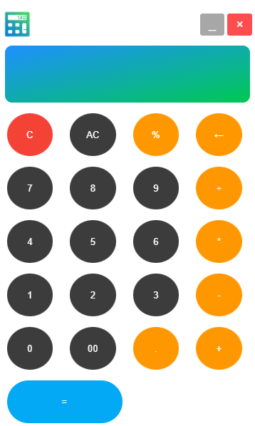

# El Calculator 

El Calculator

This project aims to build a premium-looking and fully functional real-world Calculator using JavaScript-based technologies.

The Windows, Mac, and Linux variants of the application are built using Chromium, Electron, and Node.js.  
The smartphone variant will be written using React Native.

### Technologies Used:
- Chromium
- Node.js
- ElectronJS
- C++ (for performance-critical parts)

This project demonstrates my ability to understand and develop software.

---

### Screenshot

---

Thank you!  
Akash Khuntia
416B617368204B68756E746961
0x41 0x6B 0x61 0x73 0x68 0x20 0x4B 0x68 0x75 0x6E 0x74 0x69 0x61
0x41 0x4B